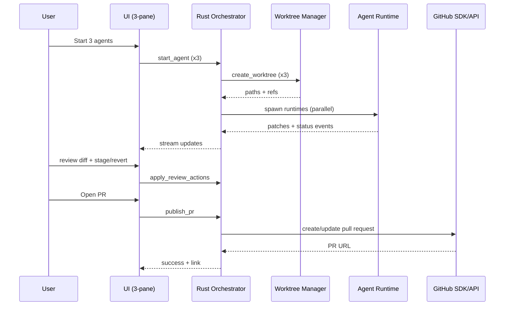

# Agent Orchestrator: Lightweight Architecture Blueprint

Last updated: 2026-02-20

## 1) Product direction
Build a review-first agent orchestration app where users can:
- authenticate with Codex, Claude Code, or provider API keys,
- run multiple specialized agents in parallel,
- isolate each agent in its own Git worktree,
- review agent output in a central git-diff reviewer,
- commit changes or open pull requests quickly via GitHub SDK/API integration.

Core promise: parallel agent throughput with strict human review control and low machine overhead.

## 2) UX specification

### 2.1 Three-pane layout
- Left pane: `Agents`
- Middle pane: `Review` (git diff reviewer, primary)
- Right pane: `Changed Files`

### 2.2 Left pane (`Agents`)
Each lane is one active agent run.
- Agent metadata: name, role, provider, branch, worktree path.
- Runtime state: queued, running, blocked, failed, completed.
- Health: last action, elapsed time, token/cost estimate, retry count.
- Controls: pause, stop, resume, rerun from checkpoint, open terminal in worktree.

### 2.3 Middle pane (`Review`)
The middle pane should behave like a focused git diff reviewer, not a chat feed.
- Unified/split diff toggle.
- Scope toggle: working tree diff, branch vs base, last-agent-turn diff.
- Hunk actions: stage, unstage, revert.
- Inline comments on lines and files.
- File-level status: approved, needs changes, unresolved.
- Reviewer checklist: correctness, security, tests, maintainability.
- “Send review feedback to selected agent” action.

### 2.4 Right pane (`Changed Files`)
This pane is a fast file navigator for all modifications currently in scope.
- Group by state: staged, unstaged, untracked, conflicts.
- Search/filter by filename and extension.
- File badges: `A`, `M`, `D`, `R`, conflict marker.
- Change stats: additions/deletions per file.
- Click file to jump middle pane diff to that file.
- Multi-select to stage/revert selected files.

### 2.5 Publish controls
- `Commit`: generate/edit commit message, commit selected staged changes.
- `Open PR`: push branch, create PR, copy/open PR URL.
- `Draft PR`: same flow with draft mode.

## 3) Product decisions (updated)

### 3.1 GitHub integration: SDK/API over MCP
Use GitHub SDK and direct API calls for V1, not GitHub MCP.
- Lower runtime complexity.
- Fewer background services/processes.
- Simpler permission model and clearer error handling.
- Easier to ship as a lightweight desktop app.

### 3.2 Runtime strategy: lightweight by design
Avoid Python-heavy orchestration stacks for local desktop execution.
- Prefer a Rust core runtime.
- Keep long-lived processes minimal.
- Spawn short-lived subprocesses only when needed (for provider CLIs/git).

### 3.3 Platform strategy
Two valid paths:
1. Recommended cross-platform: Tauri 2 + Rust core + web UI.
2. macOS-first native: SwiftUI shell + embedded Rust core via FFI.

## 4) Research-backed constraints and opportunities

### Codex
- Codex supports both ChatGPT login and API key login paths depending on environment. [1]
- Codex supports multi-agent workflows and parallel specialized agents. [2]
- Codex worktrees are designed for parallel task isolation and are detached-HEAD by default. [3]
- Codex review UX supports staged/unstaged/revert flows at diff, file, and hunk levels. [4]

### Claude Code
- Claude Code supports multiple login/account modes and account switching. [5]
- API-key mode (`ANTHROPIC_API_KEY`) is supported. [6]
- Custom subagents can be configured at user or project scope. [7]

### Git worktrees
- Git worktrees allow multiple working trees from one repository, with branch checkout constraints. [8]

### GitHub SDK/API
- GitHub provides versioned REST APIs and GraphQL APIs for PR/repo workflows. [9][10]
- Official Octokit SDKs are available and maintained by GitHub for supported ecosystems. [11][12]

### Lightweight desktop stack options
- Tauri 2 is positioned for small app size and Rust-backed application logic. [13]
- Rust async runtime (Tokio) gives explicit control over task scheduling and shutdown behavior. [14]
- SwiftUI is a practical native shell option for Apple-platform-first builds. [15]

## 5) Proposed architecture (lightweight)

### 5.1 Process model
Target a predictable process budget.
- 1 UI process (desktop shell/webview).
- 1 Rust orchestrator process.
- `N` child worker processes for active agent runs (bounded, default 3).
- 0 always-on Python processes.

Implementation notes:
- Use a bounded worker pool; queue overflow stays in memory/disk queue.
- Child processes are terminated on idle timeout.
- Keep git and provider command calls scoped and short-lived.

### 5.2 Core components
1. UI Shell
- Three-pane review-first interface.
- Realtime updates via local IPC/WebSocket channel.

2. Orchestrator Core (Rust)
- Owns scheduling, state machine, retries, guardrails, and audit events.

3. Provider Adapters
- `CodexAdapter`
- `ClaudeCodeAdapter`
- `ApiKeyAdapter` (OpenAI-compatible/Anthropic/etc.)
- Standard interface: `start_task`, `send_input`, `stream_events`, `stop`, `resume`.

4. Worktree Manager
- Creates and tracks per-agent worktrees.
- Enforces branch/worktree safety constraints.

5. Git Service
- Diff snapshots, stage/unstage/revert actions, commit creation.
- Implement via git CLI wrapper first; evaluate libgit2 later for deep embedding.

6. Review Engine
- Builds diff view models for middle pane.
- Stores review comments and approval states.

7. GitHub Integration Service (SDK/API)
- Handles PR creation, update, reviewer assignment, labels.
- Uses GitHub App token or fine-grained PAT.

8. Secrets Manager
- Token storage via OS keychain/secure store.

9. Event + Telemetry Layer
- Agent run traces, tool latency, failure taxonomy, local diagnostics.

### 5.3 High-level flow

## 6) Worktree strategy

### 6.1 Lifecycle
1. Choose base ref per task.
2. Create worktree under `.orchestrator/worktrees/<agent_run_id>`.
3. Run agent in isolated worktree.
4. Review and curate changes in the middle/right panes.
5. Commit and publish or archive.
6. Cleanup per retention policy.

### 6.2 Branch policy
- Do not check out the same branch in two active worktrees.
- Branch naming convention: `agent/<task_slug>/<short_id>`.
- Pre-commit guardrail: verify index and branch state.

### 6.3 Cleanup policy
- Auto-prune stale archived worktrees after retention window.
- Allow `pin worktree` to skip pruning.
- Preserve diff snapshots and run metadata for replay.

## 7) Middle pane as git diff reviewer

### 7.1 Reviewer modes
- `Files changed` mode: file-by-file review.
- `Conversation` mode: show inline threads and unresolved comments.
- `Risk mode`: prioritize files with high churn, generated code, or test gaps.

### 7.2 Reviewer actions
- Stage/unstage/revert at hunk and file level.
- Mark findings as blocking/non-blocking.
- Send a summarized revision request back to an agent.
- Compare latest revision against previous agent attempt.

### 7.3 Reviewer automation
Optional reviewer agent operates read-only over selected diff scope and emits:
- severity (`blocker`, `high`, `medium`, `low`)
- category (`bug`, `security`, `performance`, `test-gap`, `maintainability`)
- evidence (`file`, `line`, rationale)
- suggested fix

## 8) Right pane changed-files model

### 8.1 Data shown per file
- file path
- status (`A`, `M`, `D`, `R`, conflict)
- `+/-` counts
- staged/unstaged indicator
- ownership hint (which agent last touched it)

### 8.2 Interaction model
- Single click: load diff in middle pane.
- Multi-select: batch stage/revert.
- Hotkeys:
- `j`/`k` to navigate files
- `s` to stage file
- `u` to unstage file
- `r` to revert selection (with confirmation)

### 8.3 Performance notes
- Virtualized file list for large diffs.
- Lazy-load diff hunks for selected file only.
- Cache parsed diff by commit range and invalidation hash.

## 9) Publish workflow with GitHub SDK/API

### 9.1 Auth model
Preferred:
- GitHub App installation tokens (scoped, short-lived).

Fallback:
- Fine-grained PAT with minimum required repo permissions.

### 9.2 Commit flow
- User stages curated changes.
- System proposes commit message (editable).
- Commit in selected worktree.
- Push branch (manual or automatic, configurable).

### 9.3 PR flow
Preflight:
- remote reachable
- branch push successful
- base branch exists

Create/update flow:
- create PR (draft or ready)
- update PR body/labels/reviewers
- return and open PR URL

### 9.4 API/SDK implementation options
- If JS-heavy app: use `octokit` package.
- If Rust-centric app: call GitHub REST/GraphQL directly with typed request layer.
- Keep all GitHub tokens server-side in orchestrator process, never in renderer.

## 10) Data model (minimum viable)
- `user`
- `workspace`
- `repository`
- `provider_connection` (provider, auth_method, secret_ref, status)
- `agent_role` (name, policy, model, instructions)
- `agent_run` (role, provider, status, started_at, ended_at, cost, worktree_id)
- `worktree` (path, base_ref, branch_ref, state)
- `diff_snapshot` (scope, ref_a, ref_b, created_at)
- `review_comment` (file, line, body, author, status)
- `publish_action` (commit|pr, payload, result_url, status)
- `audit_event` (actor, action, target, metadata, timestamp)

## 11) Non-functional requirements
- Reliability: idempotent publish endpoints and exactly-once worktree creation.
- Performance: interactive diff review with large-file virtualization.
- Resource efficiency: bounded process count and bounded parallel agents.
- Security: encrypted secrets, full audit trail, permission minimization.
- Observability: per-agent traces, latency histograms, failure taxonomy.

## 12) Recommended V1 stack

### Option A (recommended): Cross-platform lightweight
- Shell: Tauri 2
- UI: React + TypeScript + Monaco diff editor
- Core runtime: Rust + Tokio
- Storage: SQLite (desktop) or Postgres (hosted mode)
- Queue: in-process bounded queue (desktop), Redis queue only for hosted scale
- Git integration: git CLI wrapper first
- GitHub integration: Octokit or direct REST from Rust

Why this is recommended:
- Low memory footprint compared to Electron-heavy stacks.
- Strong control of process lifecycle.
- Easy path to ship macOS/Windows/Linux from one codebase.

### Option B: macOS-native first
- Shell/UI: SwiftUI
- Core runtime: Rust library + Swift FFI bridge
- Same worktree/review/publish model as Option A

Why choose this:
- Native Apple UX and tighter OS integration.
- Best when macOS is the only serious target.

## 13) Delivery roadmap

### Phase 1 (MVP)
- Provider login/connect flows (Codex, Claude, API key)
- Multi-agent runs with per-agent worktrees
- Three-pane UI with git diff reviewer in the center
- Right-pane changed-files navigation/actions
- Commit and PR creation via GitHub SDK/API

### Phase 2
- Reviewer role templates and policy packs
- Cost budgets, concurrency controls, and safety guardrails
- Replayable runs and deterministic resume points

### Phase 3
- Advanced auto-routing to specialist agents
- Merge queue and required-check policy integration
- Team-level governance and analytics dashboards

## 14) Key risks and mitigations
- Worktree/branch collisions: enforce branch uniqueness and preflight checks.
- Token misuse: prefer GitHub App tokens and strict secret storage.
- Noisy agent output: enforce human review gate before publish.
- Performance regressions: process budget caps and lazy loading in diff engine.
- Local machine resource spikes: bounded concurrency with automatic backpressure.

## 15) Success metrics
- 30%+ reduction in time-to-PR for multi-file tasks.
- 80%+ reviewer acceptance rate for agent-generated code.
- <2% publish failure rate due to tool/orchestration errors.
- Stable desktop resource envelope under default concurrency (for example 3 agents).

## 16) References
1. OpenAI Codex Authentication: https://developers.openai.com/codex/auth
2. OpenAI Codex Multi-agents: https://developers.openai.com/codex/multi-agent
3. OpenAI Codex Worktrees: https://developers.openai.com/codex/app/worktrees
4. OpenAI Codex Review: https://developers.openai.com/codex/app/review
5. Claude Code Quickstart: https://code.claude.com/docs/en/quickstart
6. Claude Code Settings (`ANTHROPIC_API_KEY`): https://code.claude.com/docs/en/settings
7. Claude Code Subagents: https://code.claude.com/docs/en/settings
8. git-worktree docs: https://git-scm.com/docs/git-worktree
9. GitHub REST API overview: https://docs.github.com/en/rest/about-the-rest-api
10. GitHub GraphQL API overview: https://docs.github.com/en/graphql
11. GitHub REST API libraries: https://docs.github.com/en/rest/using-the-rest-api/libraries-for-the-rest-api
12. Octokit org (official SDKs): https://github.com/octokit
13. Tauri 2 docs: https://v2.tauri.app/
14. Tokio runtime docs: https://docs.rs/tokio/latest/tokio/runtime/
15. SwiftUI overview: https://developer.apple.com/swiftui/
